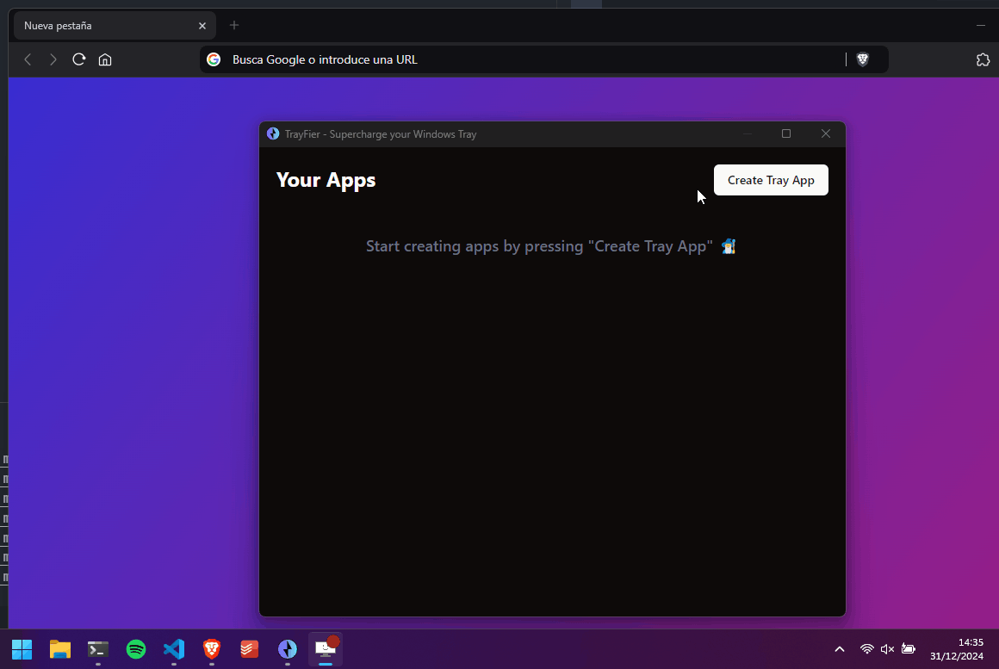

  

<h1 align="center">TrayFier</h1>

  <strong>Customize your Windows Tray 🧙‍♂️</i></strong>
   
  <i>Built with ❤️‍🔥 by <a href="https://github.com/dubisdev">@dubisdev</a></i>

  <a href="https://github.com/dubisdev/trayfier/releases/latest">
    🔗 Go to Download Page
  </a>
    &nbsp; | &nbsp; Give it a Star ⭐

  
  

  

<!-- # Features 🧙‍♂️

TrayFier is a simple tool that allows adding custom actions to the Windows Tray.

- **Easy as 1-2-3**: Input a Name + Choose an Icon + Select a Path/Url = Done! -->

<!-- ## Roadmap

- [ ] Add config menu
- [ ] Save images to own src to avoid lost if image is deleted in origin folder
- [ ] Configure shortcuts for Actions
- [ ] Multiple actions in One Tray Icon (menus & submenus)
- [ ] Multiple actions in one -> Press one, do more than one thing

## Planned Actions

- [x] Open SRC (image, folder, executable...)
- [ ] Execute code
- [ ] System Actions (volume up/down, silence, screen capture, shutdown ...) -->

## 🔐 Privacy Policy

TrayFier does NOT:

- collect any personal information,
- track you,
- send any data to any server.

Any preferences and configuration are stored locally on your computer.
It only uses the internet to check for updates and download them if you allow it.

## ⚖️ License

[MIT](./LICENSE.md) © [David Jimenez](https://dubis.dev)

